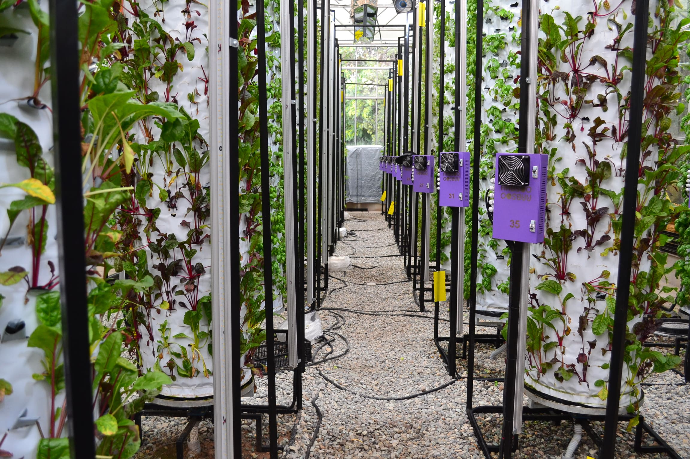
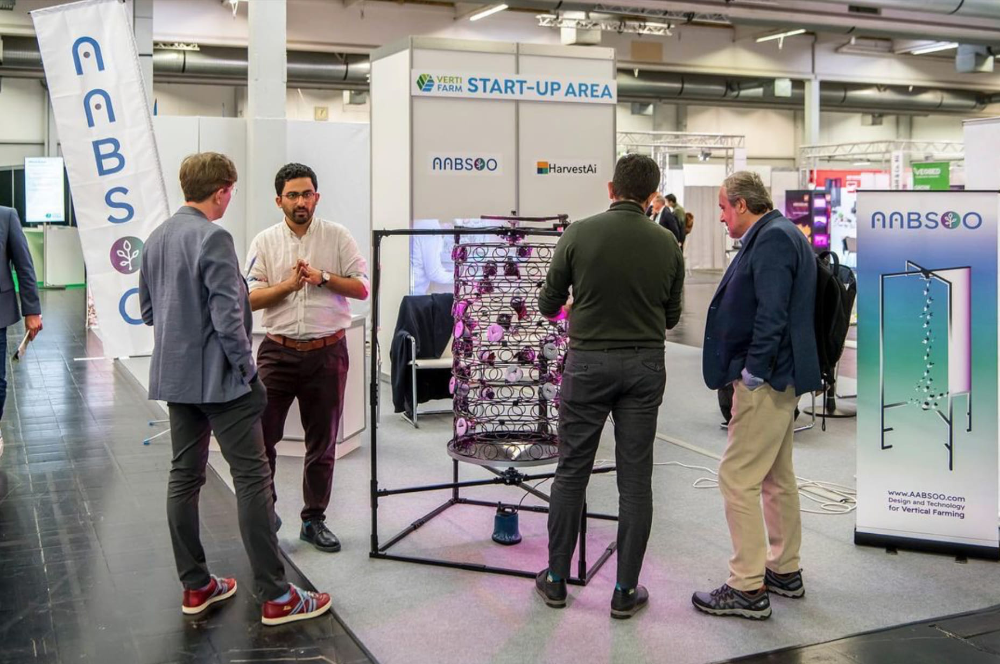

+++
weight = 10
+++

I work with `products`.

 
 

- Founded [AABSOO](https://aabsoo.com/) vertical farming organization. (next photo)

- Innovation Consultant at Food and Agriculture Organization of UN and presented workshops for +170 participants.

- researched and designed interaction of [Power Plant](http://mfadt.parsons.edu/2016/blog/2016/04/25/power-plant/), master's thesis at Parsons School of Design.

---

---

I talk about `interactions` and `experiences`. 

 
 

- Presented AABSOO at VertiFarm, first summit of vertical farming in Dortmund. (next photo)

- Held +100 events and meetings for startup sector toward partneships as Business Developer at DMOND Accelerator.

- Designed an interactive environment for an open call exhibition in a gallery space. [(Video)](https://vimeo.com/312888235)

---

---
I use `Data` for many causes.

 
 

- Data Visualization for Tehran City Council Watch. (next photo)

- Developer of civic.nyc in partnership with Microsoft for University Transdisciplinary Lab at The New School.

- Ms.Foundation Fellowship to Partner with Oregon Foundation for Reproductive Health. [(Documentation)](https://onekeyquestion.wordpress.com/) 

---

---
I'm passionate about `publishing`.

 
 

- Translation of [Carbon Map](https://www.carbonmap.org/) made possible at [Meidaan](https://meidaan.com/archive/author/nimabehravan).

- Designer by all means for [Scissors Publication](https://www.gheychi.net/) and [Bot](https://www.twitter.com/30zerMbot). 

- Director of [PhotoBook Tehran](https://www.icp.org/events/photobook-tehran-opening-reception-1at) at Internation Center of Photography Library.

---

## 

Feel free to email me:

behravan.nima@gmail.com

 

or review my resume:

[download here](https://drive.google.com/file/d/1mqJxFJ9hin7A6wvZ6d1uHWz3Z543bB0Z/view?usp=sharing)

 

Thanks.

